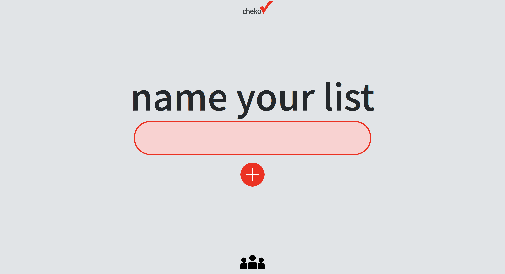

Chekov is to-do list app written in pure, vanilla JavaScript. It allows users to create multiple to-do lists and add, edit, and delete tasks on each list. Data is persisted across browser sessions using local storage.

The application is written using only JavaScript, HTML, and CSS—no outside libraries, frameworks, or languages are used.

This version of the application was designed with a Model-View-Controller pattern.

- `model.js` defines the shape of the persisted list and task data stored in local storage. It uses the [`Window.localstorage`](https://developer.mozilla.org/en-US/docs/Web/API/Window/localStorage) API to fetch/save data.
- `view.js` displays the current Model data to the user. It renders all the dynamic DOM elements to the page, sets up all the event listeners, and passes functions from `controller.js` to handle events where a change in the view or model needs to take place.
- `controller.js` receives user input (through DOM event handlers) which update the Model and View. To achieve this, the Controller takes an instance of a Model and View in its class constructor and calls the appropriate methods of each, depending on the user interaction.
  > An interesting piece of this app: to respond to events on the page, the Controller passes its class methods _into_ View class's methods. To keep the Controller's methods bound to the appropriate `this`, the [`bind()`](https://developer.mozilla.org/en-US/docs/Web/JavaScript/Reference/Global_objects/Function/bind) method is used when they're passed in as parameters. See this in [the class constructor in `controller.js`](https://github.com/BillyBunn/chekov/blob/master/js/controller.js).
- `app.js` serves as the entry point, where instances of the Model, View, and Controller are created and the application is started.

[See it deployed on GitHub pages](https://billybunn.com/chekov/)

---

### Original Project

This repository is a fork of a final course project at a coding bootcamp, [Code Fellows](https://www.codefellows.org/)’ _Code 201_ course. The original project was created by 4 junior developers (with only 3 weeks of programming experience) in four days.

This fork is a re-working of the original project by [Billy Bunn](https://github.com/BillyBunn), started and completed approximately four months later.

#### Original Team Credits

- [Shukri Abdi](https://github.com/sabdi21)
- [Billy Bunn](https://github.com/BillyBunn)
- [Andrew Curtis](https://github.com/amjcurtis)
- [Cory Henderson](https://github.com/cory0s)

This was one of my first projects as a new developer—at the time, I had only three weeks of experience learning programming basics and JavaScript syntax. The app was built in the course of four days on a team of four peers (complete beginners).

There were several constraints/requirements given to my team for the original project:

- No 3rd-party frameworks or libraries—only pure JavaScript for all logic and DOM manipulation
- Roughly follow some agile software programming practices (pair programming, [user stories](https://github.com/abc-s/201-final-project/blob/master/planning/user-stories.md), [workflow organization](https://github.com/abc-s/201-final-project/projects/1), etc.)
- Thoroughly plan and document the architecture of our application ([planning docs](https://github.com/abc-s/201-final-project/tree/master/planning))
- Begin work Monday and complete all work Thursday (of the same week)
- Give a project presentation that Friday ([slides](https://github.com/abc-s/201-final-project/blob/master/planning/presentation-slideshow.pdf))

It's always fun looking back and laughing at old work, but I'm proud of what this small app represents in my journey as a developer.

[See the repository for the original on GitHub](https://github.com/abc-s/201-final-project).

<!-- 
 -->