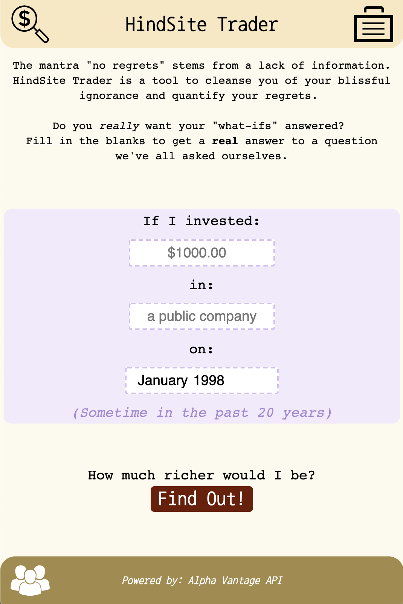

HindSite Trader is a website that lets you look back in time and see what your investment would be worth if you had invested in any publicly traded company in the U.S. at a given point in time. You can also save your searches and come back to them later to cry over your poor investment choices.

This project uses the following:
- **Languages**: JavaScript, SQL
- **Libraries and frameworks**: Node.js, Express, jQuery, Chart.js, Moment.js
- **Database**: PostgreSQL
- **Deployment platform**: Heroku
- **3rd-Party APIs**: [Alpha Vantage](https://www.alphavantage.co/)

See it deployed at [hindsite.trade](http://hindsite.trade/).

